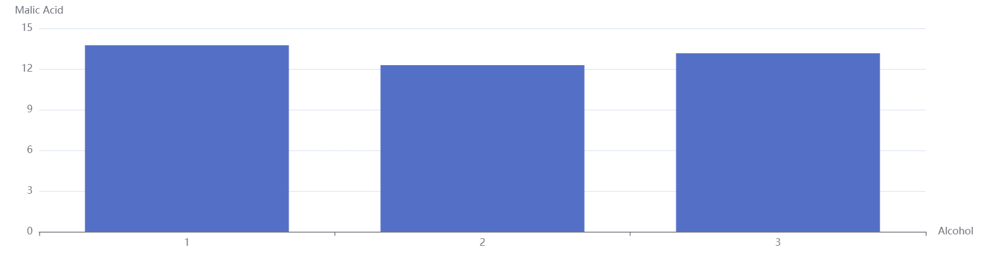
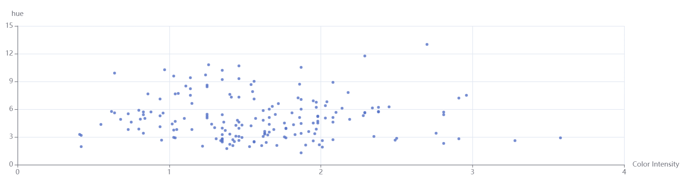

Namaste,

1. git clone this file or download the zip folder from the github page and extract it
2. open terminal and go to the folder where src and public folders are located.
3. run command 'yarn start' there.

## Description
1. The bar chart contains different classes of "Alcohol" on the x-axis and average of malic acid in y-axis.

2. The Scatter chart contains Color Intensity on the x-axis and Hue on the y-axis.

